# Quorum-AI

> One question. Four models. One answer you can verify.

Quorum-AI runs your question against four LLMs in parallel, has a separate moderator model critique their answers, and returns a single answer — written by a separate synthesis model — with explicit consensus, disagreement, source support, uncertainty, and recommendation. Cost is estimated before execution; higher-cost runs require confirmation. Results are ephemeral.

**Live workspace:** [quorum.stackclimb.com](https://quorum.stackclimb.com) —
[`/ready`](https://quorum.stackclimb.com/ready) reports whether execution is live
or degraded. Cost controls gate every run, with explicit approval required for
higher-cost requests.

**Contribute:** read the account-level
[CONTRIBUTING.md](https://github.com/imrohitagrawal/.github/blob/main/CONTRIBUTING.md),
then use [Discussions](https://github.com/imrohitagrawal/quorum-ai/discussions)
for questions and architectural ideas or
[Issues](https://github.com/imrohitagrawal/quorum-ai/issues) for reproducible
defects and accepted work.

The product brief is in [docs/PRODUCT_BRIEF.md](docs/PRODUCT_BRIEF.md). Architecture,
requirements, operations, security, and evaluation evidence are indexed under
[docs/](docs/).

---

## What it does

A user types a research question. The app:

1. **Estimates** the cost across the four model slots (one vendor per slot, picked from a static default set in `src/product_app/model_slots.py:36-41`).
2. **Runs** the four models in parallel against the real provider (`src/product_app/providers.py:160-320`). Falls back to search-only and finally to local simulation if the model call fails.
3. **Debates** — a separate moderator model (`settings.debate_model_id`) reads all four answers and writes a critique. Two rounds. The four answer models do not read each other; peer critique between them is planned, not built (#290). (`src/product_app/debate.py:263-604`)
4. **Synthesizes** a final 5-field response: consensus, disagreement, source support, uncertainty, recommendation. (`src/product_app/synthesis.py:131-470`)
5. **Surfaces drift** — if the live  model catalog has dropped any of the four static defaults, the workspace shows a banner and the `/v1/models/defaults` endpoint exposes `stale_model_ids` so an operator can see what's drifted without re-reading the catalog.

The whole thing is ephemeral. No query is persisted; refreshing the page loses the result. This is a deliberate product posture for a research/synthesis tool — not a chat log.

---

## Run it

The app runs on Python 3.13 with `uv`. The four model slots default to:

- `openai/gpt-4o-mini`
- `anthropic/claude-haiku-4.5`
- `google/gemini-2.5-flash`
- `deepseek/deepseek-chat-v3.1`

The actual live execution path is gated on `OPENROUTER_LIVE_EXECUTION_ENABLED=true` and a real `OPENROUTER_API_KEY` in `.env`. With both set, every slot hits the live API; without either, the app silently runs in local-simulation mode (templated outputs). The smoke-probe added in `b42f0aa` makes that degraded state visible at startup.

```bash
# 1. Install dependencies
uv sync

# 2. Copy and edit env
cp .env.example .env  # then set OPENROUTER_API_KEY and OPENROUTER_LIVE_EXECUTION_ENABLED=true

# 3. Run dev server
UV_CACHE_DIR=$PWD/.uv-cache PYTHONPATH=src \
  uv run uvicorn product_app.main:app --host 127.0.0.1 --port 18084

# 4. Open the workspace
open http://127.0.0.1:18084/ui
```

**`.env` is in `.gitignore`.** Never commit it; the API key belongs only on the host that makes outbound calls.

---

## Test status

```bash
make test
```

- **198 tests** passing, ~93% line coverage.
- Unit, integration, and end-to-end suites all run from `make test`. The e2e workflow is timing-sensitive; the catalog API can return 403 mid-session, so the suite is designed to be re-run on a single-test flake rather than masked. See `docs/56-flaky-test-register.md` for the register.
- Security redaction tests live in `tests/security/test_release_security_redaction.py` and are pinned in CI. They pass.

The `make test` target is also wired into GitHub Actions (see `.github/workflows/test.yml`).

---

## Production evidence

Live signals, SLOs, the ops dashboard, the scheduled availability alert, the
incident runbook, and a 60–90 s demo click-path — each claim tied to a real
PR/SHA/run-id — are collected in **[`docs/124-demo-evidence.md`](docs/124-demo-evidence.md)**.
Observability details live in [`docs/80-observability.md`](docs/80-observability.md).

---

## Architecture (one-screen view)

The full architecture document is at [docs/20-architecture.md](docs/20-architecture.md) with C4 diagrams in [diagrams/](diagrams/). The high-level shape:

```
┌────────────────────────────────────────────────────────────────┐
│  Browser (workspace.html + app.js + app.css)                   │
│  Renders 4 model panels, debate rounds, synthesis sections     │
└──────────────────────────┬─────────────────────────────────────┘
                           │  /v1/query-runs/estimate, /run, /poll
                           ▼
┌────────────────────────────────────────────────────────────────┐
│  FastAPI app (src/product_app/main.py)                          │
│  - CSRF + cookie session middleware (src/product_app/auth.py)   │
│  - Cost guardrail ($0.25 hard cap at costs.py:35-36)            │
│  - Live-readiness smoke-probe (src/product_app/readiness.py)    │
└─────┬──────────────────┬──────────────────┬────────────────────┘
      │                  │                  │
      ▼                  ▼                  ▼
   query_runs.py     providers.py       synthesis.py
   (state machine)   (4 vendor cascade)  (final 5-field answer)
      │                  │
      ▼                  ▼
   debate.py        catalog_fetcher.py
   (2 rounds)       (live  catalog)
```

The ASCII sketch above shows module structure; the Mermaid diagram below shows the
actual request pipeline (linear: cost estimate → 4 parallel models → debate → synthesis
→ evaluation) — the two are complementary, not identical (see
[diagrams/00-hero-diagram.md](diagrams/00-hero-diagram.md) for the source, and
[diagrams/02-c4-container.md](diagrams/02-c4-container.md) for the full 7-container
view):

```mermaid
flowchart LR
    User[User via browser] -->|"POST /v1/query-runs"| API[FastAPI app<br/>main.py]
    API --> Cost[Cost estimate<br/>costs.py]
    Cost -->|confirmed| Run[QueryRun orchestration<br/>query_runs.py]
    Run --> Providers["4 model slots, parallel<br/>providers.py"]
    Providers --> Debate["2 debate rounds<br/>debate.py"]
    Debate --> Synth["5-section synthesis<br/>synthesis.py"]
    Synth --> Eval["Trust-score evaluation<br/>evaluation.py"]
    Eval --> Result[Result shown to user]
```



Key design points, with file:line citations:

- **Cost guardrail**: hard $0.25 cap at [costs.py:35-36](src/product_app/costs.py#L35). The estimate must succeed before a run; the run is blocked if the estimate exceeds the cap.
- **Live-readiness probe**: [readiness.py:46](src/product_app/readiness.py#L46) — runs at app start, re-runs on every `/ready` hit, distinguishes `live`, `live` (with drift), `offline_by_config`, `offline_by_no_key`, and `offline_by_bad_key` (the key is set but the provider refused it — checked with a zero-token `GET /key` on a background thread, so a revoked key can no longer be served as "live").
- **Static defaults are the source of truth** for the four model slots. The  catalog is consulted as a **drift check**, not the source — see [model_slots.py:36-41](src/product_app/model_slots.py#L36) and the 4 selection tests in `tests/unit/test_model_slots.py`.
- **Redaction**: every error log strips API keys, session tokens, and raw model output before it hits the logger. The redaction tests in `tests/security/test_release_security_redaction.py` are the contract.
- **CSRF + cookie session** instead of bearer tokens. The CSRF token is bound to the session via a signed cookie; cross-site requests can't read it. See [auth.py](src/product_app/auth.py).

---

## What's interesting about this codebase

A few non-obvious properties that are worth a closer look:

- **Cheapest-per-vendor model selection that filters `:free` variants.** The `cheapest_per_vendor` function in [catalog_fetcher.py:343-367](src/product_app/catalog_fetcher.py#L343) used to pick `:free` models because they cost $0. The current implementation filters those out, falling back to the static defaults when the catalog is unreachable. The Step-A bug it closed was a demo whose "synthesized" output was actually a templated string.
- **Live-readiness smoke-probe as a four-state machine.** Most apps do a single boolean "is the key set?" check. This one logs at WARNING whenever a degraded state is detected and exposes a JSON envelope on `/ready` so an external monitor can observe the same state.
- **Drift detection over a static source-of-truth.** The architecture is deliberate: the four model ids in `DEFAULT_MODEL_IDS` are the *what we ship*; the live catalog is the *what's available now*. The drift check surfaces the gap, it doesn't auto-correct.
- **Redaction as test-pinned contract.** A static-analysis-style set of tests (`tests/security/test_release_security_redaction.py`) asserts that secret-shaped strings never appear in any error log. The redaction coverage was extended in `50c64ea`.
- **The 16-commit defense-in-depth "C-block" (C1–C16).** A focused security/quality pass that landed as 16 separate commits so each change is bisectable; the repository history preserves the implementation trail.

---

## Project layout

```
.
├── src/product_app/              # Application package
│   ├── main.py                   # FastAPI app + route definitions
│   ├── auth.py                   # Cookie session + CSRF
│   ├── providers.py              # 4-vendor live-call cascade with fallback
│   ├── debate.py                 # 2-round critique orchestrator
│   ├── synthesis.py              # Final 5-field synthesis orchestrator
│   ├── catalog_fetcher.py        #  model catalog + cheapest-per-vendor
│   ├── model_slots.py            # DEFAULT_MODEL_IDS (source of truth)
│   ├── costs.py                  # Cost estimation + $0.25 hard cap
│   ├── readiness.py              # Startup smoke-probe + /ready surface
│   ├── query_runs.py             # Async query-run state machine
│   ├── static/                   # app.js, app.css
│   └── templates/workspace.html  # The single page
├── tests/
│   ├── unit/                     # Module-level tests
│   ├── integration/              # Multi-module flows + FastAPI client
│   ├── e2e/                      # End-to-end workflows (timing-sensitive)
│   └── security/                 # Redaction contract tests
├── docs/                         # Product, architecture, ops docs
├── diagrams/                     # C4 + Mermaid diagrams
├── openapi.yaml                  # Generated OpenAPI 3.1 spec
```

Internal design-review history remains available in
[`UI_UX_Audit_Report.md`](UI_UX_Audit_Report.md) and
[`UI_Fix_Plan.md`](UI_Fix_Plan.md); it is planning evidence, not a statement that
every proposed UI change has shipped.

---

## License

Internal portfolio project. Not currently licensed for redistribution.
