# Quorum-AI

> One question. Four models. One answer you can verify.

Quorum-AI runs your question against four LLMs in parallel, has a separate moderator model critique their answers, and returns a single answer — written by a separate synthesis model — with explicit consensus, disagreement, source support, uncertainty, and recommendation. Every finished run is also evaluated for a **trust score**, though on the default configuration (judge off) that score is always suppressed — see "Known limitations" below. Cost is estimated before execution; higher-cost runs require confirmation. Results are ephemeral, with an export button as the way to keep one.

**Known limitations, up front:**
- **No accounts, no login, no identity check.** Each browser gets an anonymous session (an opaque token, validated server-side) tied to a randomly generated `account_id` — there's no username, password, or registration to bypass. Minting a *new* session is IP-rate-limited; using an existing one to run queries is rate-limited per `account_id`, not per IP.
- **Trust score ships `null` by default.** The judge that unlocks a numeric score is off unless explicitly configured; every run otherwise shows `band="unverified"`.
- **Single-instance deployment, by design.** Both durable SQLite stores are single-writer (ADR-0002); a $5.00/day *global* spend ceiling is shared across every account, not per-user.
- **The "nightly" audit job isn't scheduled by anything.** It only runs via a manual `make feedback-audit`.

**Workspace:** [quorum.stackclimb.com](https://quorum.stackclimb.com) —
[`/ready`](https://quorum.stackclimb.com/ready) reports whether execution is live
or degraded right now; [`/status`](https://quorum.stackclimb.com/status) reports
the deployed build. Live-model calls are gated behind
`OPENROUTER_LIVE_EXECUTION_ENABLED`, so the deployed instance can legitimately run
in `offline_by_config` (local-simulation) mode at any given moment — check `/ready`
rather than assuming "deployed" means "calling real models." Cost controls gate
every live run, with explicit approval required for higher-cost requests.

**Contribute:** read the account-level
[CONTRIBUTING.md](https://github.com/imrohitagrawal/.github/blob/main/CONTRIBUTING.md),
then use [Discussions](https://github.com/imrohitagrawal/quorum-ai/discussions)
for questions and architectural ideas or
[Issues](https://github.com/imrohitagrawal/quorum-ai/issues) for reproducible
defects and accepted work.

The product brief is in [docs/PRODUCT_BRIEF.md](docs/PRODUCT_BRIEF.md). Architecture,
requirements, operations, security, and evaluation evidence are indexed under
[docs/](docs/).

---

## What it does

A user types a research question. The app:

1. **Warns** — the sensitive-data warning is required for *every* query, unconditionally; the high-stakes (medical/legal/financial/safety) warning is added only when the query text or context matches a pattern for that. The server won't start a run until both are satisfied — but in the shipped UI, only the high-stakes warning has a real checkbox the user clicks; the sensitive-data acknowledgement is submitted automatically by client code, not by an affirmative user action (`src/product_app/safety.py`, `templates/workspace.html`).
2. **Estimates** the cost across the model slots — one vendor per slot, defaulting to a static set in `src/product_app/model_slots.py`, but a caller can submit a different model list and it's used and persisted as-is (the UI exposes a picker per slot).
3. **Runs** the four models in parallel against the real provider (`src/product_app/providers.py`). When live execution is disabled (or no key), each slot independently falls back to either local simulation or a real web search — decided per slot by trigger conditions, not one mode for the whole run. A failed individual live call, by contrast, reports a failed slot; it's never silently swapped for a fabricated or simulated answer.
4. **Debates** — a separate *call*, in a distinct critique role, reads all four answers and writes a critique (`settings.debate_model_id`) — by default this happens to be the same model as slot 2 (`anthropic/claude-haiku-4.5`), not a different model chosen for the job. Two rounds. The four answer models do not read each other; peer critique between them is planned, not built (#290). (`src/product_app/debate.py`)
5. **Synthesizes** a final 5-field response: consensus, disagreement, source support, uncertainty, recommendation. (`src/product_app/synthesis.py`, with consensus-strength classification in `synthesis_consensus.py` and length discipline in `synthesis_length.py`)
6. **Scores trust** — a deterministic, hermetic evaluation of the finished run's *structure* (not the truth of its claims, and not the content of its sources): are citation markers grounded, what fraction of claims cite something, did the models agree, was disagreement suppressed. Even the optional LLM-as-judge only ever sees each source's title and URL, never fetches or reads the linked page — "citation support" means the claim text is consistent with what the source is titled, not that the source's content was checked. The numeric score is computed either way, but it is only ever *shown* when a real judge (off by default) confirms that consistency; otherwise every run is served `band="unverified"`, `score=null` (`src/product_app/evaluation.py`).
7. **Surfaces drift** — if the live model catalog has dropped any of the four static defaults, the workspace shows a banner and the `/v1/models/defaults` endpoint exposes `stale_model_ids` so an operator can see what's drifted without re-reading the catalog.

The whole thing is ephemeral by default. No query is persisted for the user, and refreshing the page loses the result — this is a deliberate product posture for a research/synthesis tool, not a chat log. The workspace's own UI pairs that tradeoff with an explicit Export/Copy button so the user has a way to keep a result before it's gone. A separate feedback/audit trail (`src/product_app/feedback_store.py`, `feedback_audit.py`) — append-only outside a one-time schema migration — records billing- and reliability-relevant events server-side for operators; it is not a user-facing history.

---

## Run it

The app requires Python >=3.12 (`pyproject.toml`; CI runs 3.12) and `uv`. The four model slots default to:

- `openai/gpt-4o-mini`
- `anthropic/claude-haiku-4.5`
- `google/gemini-2.5-flash`
- `nvidia/nemotron-3-nano-30b-a3b`

The actual live execution path is gated on `OPENROUTER_LIVE_EXECUTION_ENABLED=true` and a real `OPENROUTER_API_KEY` in `.env`. With both set, every slot hits the live API — unless the global daily spend ceiling has been reached or the spend ledger can't be trusted, in which case the run silently degrades to simulation regardless (see the cost-guardrail point in Architecture, ADR-0016). With the flag left `false` (or unset), the app falls back to local-simulation mode (templated outputs) regardless of whether a key is present. **These aren't the same failure mode**: flag `true` with a missing key doesn't fall back to simulation — it fails the whole run outright. A startup probe surfaces a flag/key mismatch at `/ready` before you'd otherwise hit this at request time.

```bash
# 1. Install dependencies
uv sync

# 2. Copy and edit env
cp .env.example .env  # then set OPENROUTER_API_KEY and OPENROUTER_LIVE_EXECUTION_ENABLED=true

# 3. Run dev server
UV_CACHE_DIR=$PWD/.uv-cache PYTHONPATH=src \
  uv run uvicorn product_app.main:app --host 127.0.0.1 --port 18084

# 4. Open the workspace
open http://127.0.0.1:18084/ui
```

**`.env` is in `.gitignore`.** Never commit it; the API key belongs only on the host that makes outbound calls.

**Or with Docker:** `docker compose up` builds from the repo-root `Dockerfile` and runs on `127.0.0.1:8000` — open `http://127.0.0.1:8000/ui`. It reads secrets from `.env` (pinned explicitly in `docker-compose.yml` — `.env.example` alone is not enough, it's a template with no real key). Copy and fill in `.env` first, same as above.

Production runs on Fly.io (`fly.toml`, `fly deploy`) as a **single, non-scaled instance** — the in-memory session/query-run state and the single-writer SQLite stores below are sized for that on purpose; see [`DEPLOY.md`](DEPLOY.md) for the full deploy runbook and secrets setup. `fly.toml` also sets `min_machines_running = 0` (scale-to-zero when idle), so the first request after a quiet period pays a cold-start on top of normal latency.

**Latency shape**: a live run's critical path is `max(4 parallel model calls) → debate round 1 → debate round 2 → max(5 parallel synthesis-section calls)` — four sequential LLM round-trips, not one, since the two debate rounds run one after the other. NFR-001 budgets this at P50 ≤ 45s, P95 ≤ 120s, hard timeout 180s (`tests/perf/test_workflow_latency_percentiles.py`).

---

## Test status

```bash
make test
```

- **~2,900 tests, 95% line coverage** (coverage requirement is 88%). The exact pass/skip split depends on which optional credentials your machine has set — see the [verification appendix](docs/readme-verification-appendix.md) if the two numbers you get don't match each other.
- `make test` runs `uv run pytest` only, covering `tests/unit`, `tests/integration`, `tests/contract`, `tests/resilience`, `tests/accessibility`, `tests/perf`, and `tests/e2e` (Python end-to-end specs). It does **not** run the Playwright suite.
- Playwright lives in the separate top-level [`e2e/`](e2e/) directory (28 `.spec.ts` files, not `tests/e2e/`), with its own CI workflow (`.github/workflows/e2e.yml`). It's timing-sensitive — see the local-run flags in `AGENTS.md` (rule 13) before running it directly.
- Security redaction tests live in `tests/security/test_release_security_redaction.py` and are pinned in CI.
- `make test` (`.github/workflows/test.yml`) is one of **six** required status checks gating a merge to `main`, not the whole gate — `AGENTS.md` rule 14 has the full table.

---

## Production evidence

Live signals, SLOs, the ops dashboard, the scheduled availability alert, the
incident runbook, and a 60–90 s demo click-path — each claim tied to a real
PR/SHA/run-id — are collected in **[`docs/124-demo-evidence.md`](docs/124-demo-evidence.md)**.
Observability details live in [`docs/80-observability.md`](docs/80-observability.md).
The deploy runbook and Fly.io secrets setup are in [`DEPLOY.md`](DEPLOY.md).
Recent changes are tracked in [`CHANGELOG.md`](CHANGELOG.md).

---

## Architecture (one-screen view)

The full architecture document is at [docs/20-architecture.md](docs/20-architecture.md) with C4 diagrams in [diagrams/](diagrams/). The high-level shape:

```
┌────────────────────────────────────────────────────────────────┐
│  Browser (workspace.html + app.js + app.css)                   │
│  Renders 4 model panels, debate rounds, synthesis sections     │
└──────────────────────────┬─────────────────────────────────────┘
                           │  POST /v1/query-runs/estimate, /v1/query-runs
                           │  GET /v1/query-runs/{id} (poll)
                           ▼
┌────────────────────────────────────────────────────────────────┐
│  FastAPI app (src/product_app/main.py)                          │
│  - CSRF + cookie session middleware (src/product_app/auth.py)   │
│  - Cost guardrail ($0.25 hard cap at costs.py:49)               │
│  - Live-readiness smoke-probe (src/product_app/readiness.py)    │
└─────┬──────────────────┬──────────────────┬────────────────────┘
      │                  │                  │
      ▼                  ▼                  ▼
   query_runs.py     providers.py       synthesis.py
   (state machine)   (4 slots, parallel)  (final 5-field answer)
      │                  │                  │
      ▼                  ▼                  ▼
   debate.py        catalog_fetcher.py  evaluation.py
   (2 rounds)        (live catalog)     (trust score)
```

The ASCII sketch above shows module structure; the Mermaid diagram below shows the
actual request pipeline (linear: cost estimate → 4 parallel models → debate → synthesis
→ evaluation) — the two are complementary, not identical (see
[diagrams/00-hero-diagram.md](diagrams/00-hero-diagram.md) for the source, and
[diagrams/02-c4-container.md](diagrams/02-c4-container.md) for the full 7-container
view):

```mermaid
flowchart LR
    User[User via browser] -->|"POST /v1/query-runs"| API[FastAPI app<br/>main.py]
    API --> Cost[Cost estimate<br/>costs.py]
    Cost -->|confirmed| Run[QueryRun orchestration<br/>query_runs.py]
    Run --> Providers["4 model slots, parallel<br/>providers.py"]
    Providers --> Debate["2 debate rounds<br/>debate.py"]
    Debate --> Synth["5-section synthesis<br/>synthesis.py"]
    Synth --> Eval["Trust-score evaluation<br/>evaluation.py"]
    Eval --> Result[Result shown to user]
```



Key design points, with file:line citations:

- **Cost guardrail, four tiers**: a per-run soft threshold of $0.15 requires explicit confirmation, a per-run hard cap of $0.25 blocks the run outright ([costs.py:48-49](src/product_app/costs.py#L48), `SOFT_THRESHOLD_USD` / `HARD_LIMIT_USD`), a **per-account daily cap of $0.20** ([costs.py:116](src/product_app/costs.py#L116), `DAILY_CAP_USD`), and a **global daily ceiling of $5.00 across every account** ([costs.py:150](src/product_app/costs.py#L150), `GLOBAL_DAILY_CEILING_USD` — the same number exposed live at `/status.global_daily_ceiling_usd`). If the durable spend ledger becomes untrustworthy after a fault, the system degrades to $0 local-simulation rather than serving real spend against an unreliable meter (ADR-0016). A block or ceiling-degrade event also pushes a Sentry alert with account id and estimated cost; the ceiling-degrade alert specifically also carries daily-spend context (the block alert doesn't) — so an operator doesn't have to poll `/status` to notice either. Sentry itself is initialized in `main.py` with its own redaction hooks and is surfaced (deliberately renamed, not as "sentry") at `/status.error_tracking`.
- **Live-readiness probe**: [readiness.py](src/product_app/readiness.py) — runs at app start, re-runs on every `/ready` hit, distinguishes `live`, `live` (with drift), `offline_by_config`, `offline_by_no_key`, and `offline_by_bad_key` (the key is set but the provider refused it — checked with a zero-token key probe, so a revoked key can no longer be served as "live").
- **Static defaults are the source of truth** for the four model slots. The live catalog is consulted as a **drift check**, not the source — see [model_slots.py:63](src/product_app/model_slots.py#L63) (`DEFAULT_MODEL_IDS`) and `tests/unit/test_model_slots.py`.
- **Safety warnings before a run starts**: the sensitive-data warning is required unconditionally, on every query; the high-stakes warning is added only when the query text or context matches a pattern. Either way, an unacknowledged required warning blocks `POST /v1/query-runs` (run creation) with HTTP 422. `POST /v1/query-runs/estimate` does **not** enforce this; a cost estimate can be previewed without acknowledging anything. See [safety.py](src/product_app/safety.py) and `POST /v1/query-runs/warnings`.
- **Trust score is suppressed unless a real judge verified it**: the composite number is always computed the same deterministic way (`evaluate_layer_a` in [evaluation.py](src/product_app/evaluation.py)) regardless of the judge, so the judge never changes the arithmetic — but `build_trust_score` only ever *serves* that number when `support_verified` is True, which requires a real LLM-as-judge verdict. With the judge off (the default), every run shows `band="unverified"`, `score=null`, not a computed-but-lower number. Every weight and threshold in the composite is explicitly marked uncalibrated.
- **CSRF + cookie session** instead of bearer tokens. The session cookie is opaque (`secrets.token_urlsafe(24)`), not cryptographically signed — it's validated by a server-side lookup against the session store, not a MAC the server can check without one. It's `HttpOnly`, `Secure` in production, and `SameSite=Lax`; the separate CSRF token is compared with `secrets.compare_digest`. See [auth.py](src/product_app/auth.py).
- **Durable feedback trail, best-effort not blocking**: in-memory ring buffers ([providers.py](src/product_app/providers.py), [synthesis.py](src/product_app/synthesis.py)) also write synchronously into a SQLite-backed sink ([feedback_store.py](src/product_app/feedback_store.py)) on the request thread; a failed write is caught and logged, never raised to the caller, so a durable-storage fault can't fail a user's run. `feedback_audit.py` reads that sink and exposes a summary at `GET /feedback/audit` — unlike `/health`/`/ready`/`/status`, this route requires an authenticated browser session (`Depends(require_session)`); hitting it directly returns `401 AUTH_REQUIRED` without one. Despite its own docstring calling the job a "nightly" runner, nothing in `.github/workflows/` schedules it; today it only runs via the manual `make feedback-audit` target. Both durable SQLite stores are deliberately single-writer (one connection, one lock, no WAL) — a documented decision, not an oversight, that caps this design to a single-instance deployment (ADR-0002).

---

## What's interesting about this codebase

A few non-obvious properties that are worth a closer look:

- **A tested filter and a tested picker that nothing in production wires together.** [`cheapest_per_vendor`](src/product_app/catalog_fetcher.py#L464) picks the lowest-priced catalog entry per vendor with no opinion on eligibility (it'll return a `:free` model if you let it); `model_slots.py`'s `_is_unauthenticated_variant` is supposed to filter those out first. Both are fully unit-tested — neither has a caller anywhere in `src/`. It's genuinely unwired, dead code today, despite `catalog_fetcher.py`'s own docstring describing it as feeding the UI. `DEFAULT_MODEL_IDS` is only ever a *default*, not a fixed list — a caller can submit and persist a different model set. Details and repro: [verification appendix](docs/readme-verification-appendix.md).
- **Live-readiness smoke-probe as a multi-state machine.** Most apps do a single boolean "is the key set?" check. This one logs at WARNING whenever a degraded state is detected and exposes a JSON envelope on `/ready` so an external monitor can observe the same state.
- **Drift detection over a static source-of-truth.** The architecture is deliberate: the four model ids in `DEFAULT_MODEL_IDS` are the *what we ship*; the live catalog is the *what's available now*. The drift check surfaces the gap, it doesn't auto-correct.
- **Trust score is deliberately two-tier, and the calibrated tier does not exist yet.** Layer A (deterministic, always on) is the only input to the numeric score. Layer B (LLM-as-judge) is advisory metadata that can suppress the score but never raise it, and every weight in the module is documented as chosen to match five hand-written test cases, not measured against real data.
- **A "nightly" audit job that nothing schedules** — see the "Durable feedback trail" point above.

---

## Project layout

```
.
├── src/product_app/              # Application package (~22.5k lines)
│   ├── main.py                   # FastAPI app + route definitions
│   ├── auth.py                   # Cookie session + CSRF
│   ├── providers.py              # 4 slots dispatched in parallel, each with a live→search→simulation fallback
│   ├── debate.py                 # 2-round critique orchestrator
│   ├── synthesis.py              # Final synthesis orchestrator
│   ├── synthesis_consensus.py    # Consensus-strength classification
│   ├── synthesis_length.py       # Length discipline for synthesis output
│   ├── evaluation.py             # Trust-score engine (deterministic + optional LLM judge)
│   ├── safety.py                 # Sensitive/high-stakes query warnings
│   ├── catalog_fetcher.py        # Live model catalog + cheapest-per-vendor
│   ├── model_slots.py            # DEFAULT_MODEL_IDS (source of truth)
│   ├── costs.py                  # Cost estimation + $0.25 hard cap
│   ├── readiness.py              # Startup smoke-probe + /ready surface
│   ├── query_runs.py             # Async query-run state machine + HTTP routes
│   ├── feedback_store.py         # Durable SQLite sink for feedback events
│   ├── feedback_audit.py         # Feedback audit job (manual `make feedback-audit`, not scheduled) + /feedback/audit
│   ├── run_history_store.py      # Durable terminal-run history
│   ├── store_reconnect.py        # Background reconnect for the SQLite sinks
│   ├── telemetry_sink.py         # Bounded JSONL sinks for blocked-issue telemetry
│   ├── config.py                 # Application configuration / settings
│   ├── logging_config.py         # Structured JSON logging
│   ├── request_id.py             # Per-request ID correlation
│   ├── untrusted_text.py         # Fencing for untrusted prose sent to an LLM
│   ├── visible_text.py           # "does this provider text have visible content" predicate
│   ├── provider_keys.py          # Provider API key lookup
│   ├── static/                   # app.js, app.css
│   └── templates/workspace.html  # The single page
├── tests/
│   ├── unit/                     # Module-level tests
│   ├── integration/              # Multi-module flows + FastAPI client
│   ├── e2e/                      # Python pytest end-to-end specs (NOT Playwright — see top-level e2e/)
│   ├── security/                 # Redaction contract tests
│   ├── contract/                 # API contract tests
│   ├── evals/                    # Trust-score calibration corpus
│   ├── resilience/               # Failure-injection / chaos-style tests
│   ├── accessibility/            # a11y checks
│   └── perf/                     # Hermetic stub-pipeline latency gate (not real load/throughput — see file docstrings)
├── e2e/                           # Playwright suite (28 .spec.ts), invariant specs, own CI workflow
├── docs/                         # Product, architecture, ops docs (142 top-level entries, incl. docs/adr/ with 35 more)
├── diagrams/                     # C4, Mermaid, and Excalidraw diagrams
├── configs/, policies/, schemas/, scripts/  # Factory-generated governance config + dev tooling (Makefile targets call into scripts/)
├── openapi.yaml                  # Generated OpenAPI 3.1 spec
```

---

## License

MIT + Attribution — see [`LICENSE`](LICENSE). Redistribution and modification are
permitted; a visible attribution notice naming the author must be carried through
to any distribution. `docs/learning/` (not yet written) is reserved separately
under CC BY-NC-ND 4.0 — see [`docs/learning/LICENSE`](docs/learning/LICENSE).
(This corrects a stale claim in the previous README — the `LICENSE` file itself
already read this way; nothing about the actual license changed in this revision.)
