# Hero Diagram

## Source Requirements
- FR-001 (public, account-gated AI cross-validation workflow)
- AC-001

## Diagram

```mermaid
flowchart LR
    User[User via browser] -->|"POST /v1/query-runs"| API[FastAPI app<br/>main.py]
    API --> Cost[Cost estimate<br/>costs.py]
    Cost -->|confirmed| Run[QueryRun orchestration<br/>query_runs.py]
    Run --> Providers["4 model slots, parallel<br/>providers.py"]
    Providers --> Debate["2 debate rounds<br/>debate.py"]
    Debate --> Synth["5-section synthesis<br/>synthesis.py"]
    Synth --> Eval["Trust-score evaluation<br/>evaluation.py"]
    Eval --> Result[Result shown to user]
```

## Review Notes
Sourced from `docs/20-architecture.md` (Query Workflow section) and direct reads of
`src/product_app/query_runs.py`, `providers.py`, `debate.py`, `synthesis.py`,
`evaluation.py`. Matches the ASCII diagram in `README.md`'s "Architecture (one-screen
view)" section — kept in sync with it; update both together if the flow changes.
