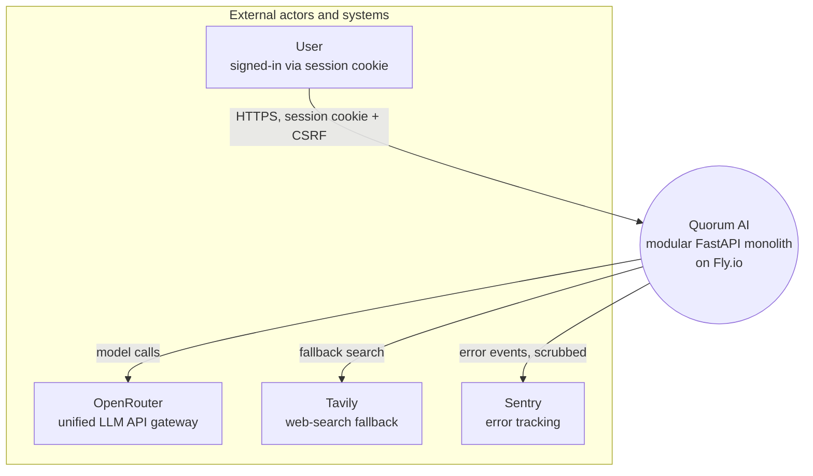

# C4 Context Diagram

## Source Requirements
- FR-001, FR-002 (see `docs/10-functional-requirements.md`)
- AC-001

## Diagram

## Review Notes
Sourced from `docs/20-architecture.md` (Containers table) and `README.md`'s stack list.
Cloudflare (DNS/HTTPS termination) sits in front of the whole system and is omitted here
as pure infrastructure, not a system Quorum AI calls.
