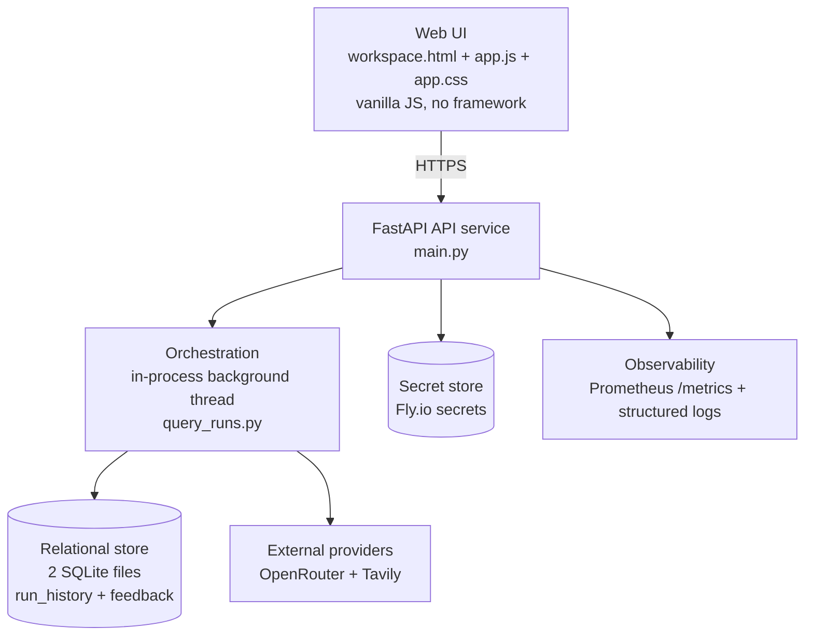

# C4 Container Diagram

## Source Requirements
- FR-001 through FR-013 (Release 1); FR-014 through FR-017 (Release 2)
- AC-001, AC-035

## Diagram

## Review Notes
The 7 containers listed in `docs/20-architecture.md`. No separate worker or cron
process — `query_runs.py`'s own module docstring: "Cookie/CSRF mode ... A background
thread then runs the pipeline." Single Fly.io machine (`fly.toml`:
`shared-cpu-1x`, 512MB, region `iad`, no autoscaling).
