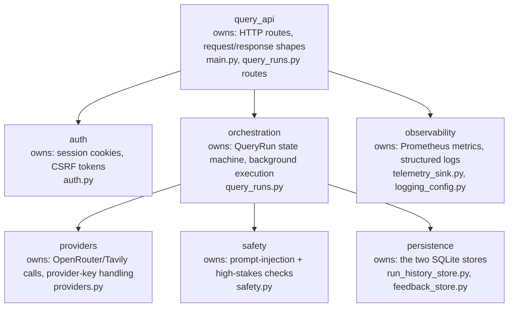

# C4 Component Diagram

## Source Requirements
- FR-001 through FR-013
- AC-001 through AC-036

## Diagram

## Review Notes
The 7 internal components and their "owns / must not own" boundaries, from
`docs/20-architecture.md`'s Components section. This skill's own rule applies here:
"Restating an ADR number or status. Link the live registry" — component boundaries here
are summarised, not re-derived; see `docs/20-architecture.md` for the authoritative text.
