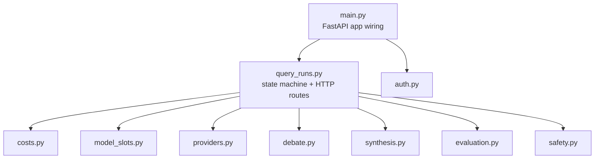

# C4 Module (Code-Level) Diagram

## Source Requirements
- FR-001 through FR-017
- AC-001 through AC-049

## Diagram

## Review Notes
`query_runs.py` is the real hub — every pipeline stage is called from it (verified by
direct reads of the call sites: `_execute_query_run`, `_evaluate_terminal_run`).
`costs.py`, `model_slots.py`, and `auth.py` are shared dependencies, not pipeline stages.
This is a code-level snapshot; keep in lockstep with the source or mark it a
point-in-time capture if it drifts (per `architecture-and-decisions`' own house style).
