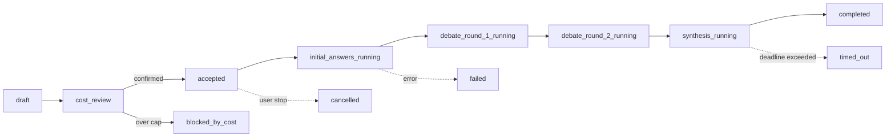

# Mermaid High-Level Diagram

## Source Requirements
- FR-001 through FR-013
- AC-001

## Diagram

## Review Notes
The real `QueryRun` state machine from `docs/21-domain-model.md` / `query_runs.py`, not
a placeholder. `partial` (some but not all stages completed) is reachable from any
`_running` state via the 180-second deadline path alongside `timed_out` — both are
non-`completed` terminal states the UI must render honestly (see
`e2e/tests/degraded/degraded-banner.spec.ts`).
