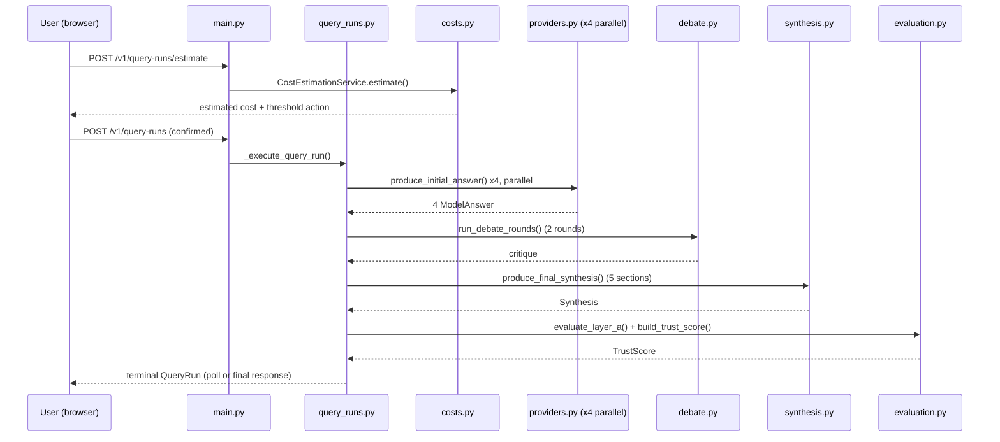

# Mermaid Low-Level Diagram (request sequence)

## Source Requirements
- FR-001 through FR-013
- AC-001, AC-035

## Diagram

## Review Notes
Function names verified against `src/product_app/query_runs.py`
(`_execute_query_run`, `_evaluate_terminal_run`), `providers.py`
(`ProviderExecutionService.produce_initial_answer`), `debate.py`
(`DebateOrchestrator.run_debate_rounds`), `synthesis.py`
(`SynthesisOrchestrator.produce_final_synthesis`), `evaluation.py`
(`evaluate_layer_a`, `build_trust_score`).
