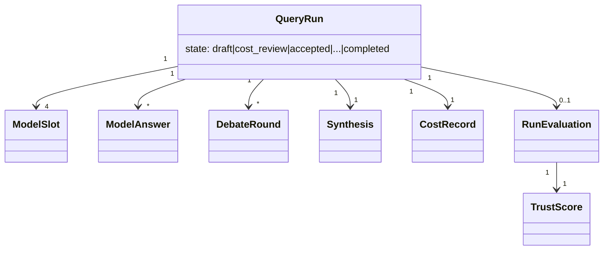

# Mermaid Module-Level Diagram (domain entities)

## Source Requirements
- FR-001 through FR-013; FR-015 (Release 2 evaluation entities)
- AC-001, AC-038 through AC-043

## Diagram

## Review Notes
The entity list and Release 2 additions (`RunEvaluation`, `TrustScore`,
`EvalJudgeVerdict`) are from `docs/21-domain-model.md`'s Entities table.
`EvalJudgeVerdict` is omitted from the diagram (advisory Layer B output, off in every
current deployment) — see 13-mermaid-sub-module-level.md for that detail.
