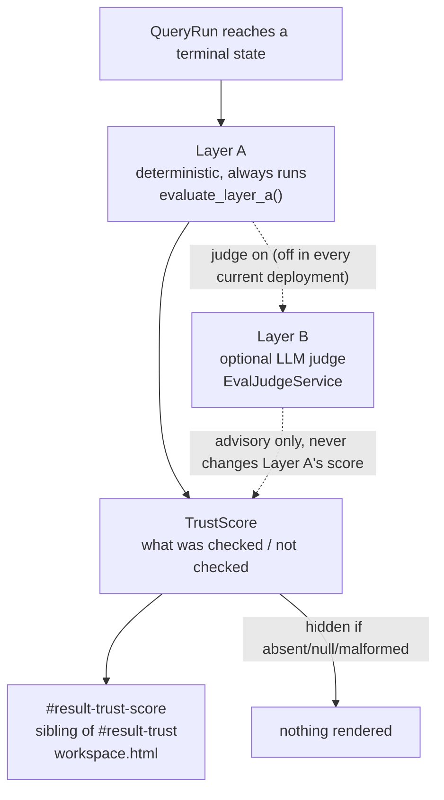

# Mermaid Sub-Module-Level Diagram (evaluation subsystem)

## Source Requirements
- FR-015, FR-016, FR-017
- AC-038 through AC-049

## Diagram

## Review Notes
Evaluation is post-terminal and request-path-independent (`docs/20-architecture.md`,
"Release 2: Evaluation Component"). The judge (Layer B) is real code but dormant in
every current deployment — the diagram marks it dotted/conditional rather than a solid
always-on path, matching `docs/design-handoff/README.md`'s "05b" section (D-14 hidden
rule, never-green rule) authored during the Release 2 design-handoff reconciliation.
