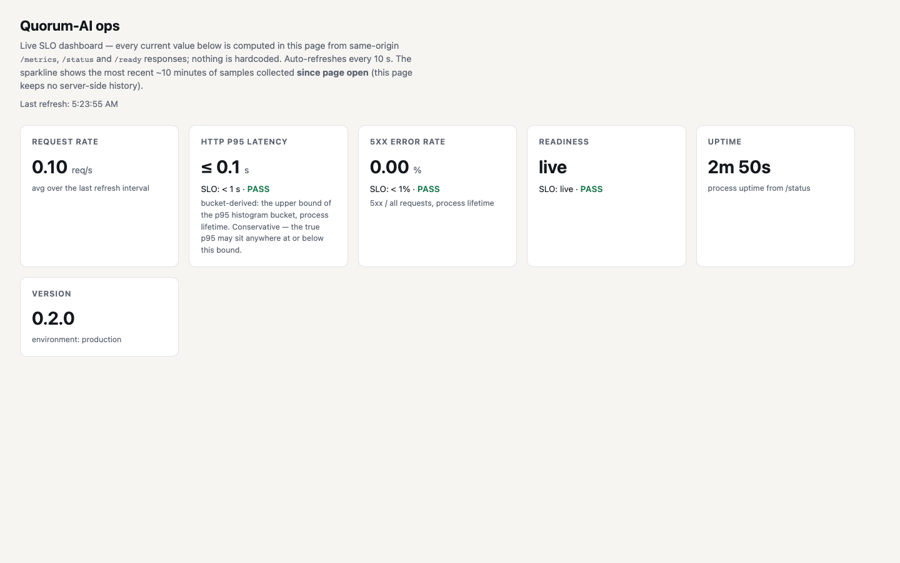

# Production evidence & demo script

Every claim below points to a **tracked artifact with a real identifier** —
a PR number, squash SHA, CI run id, pinned metrics doc, or live prod URL.
This page creates no new numbers; each was verified with `gh`/`curl` at
authoring time. Prod host: <https://quorum.stackclimb.com> (also
`quorum-ai.fly.dev`).

## Claim → artifact

| # | Claim | Artifact | Identifier (verify with) |
| --- | --- | --- | --- |
| 1 | Prometheus `/metrics` live on prod (per-route-template counts, latency histograms) | served endpoint + PR | `curl -s https://quorum.stackclimb.com/metrics \| head`; PR #77, SHA `0b014d3` |
| 2 | Self-contained ops dashboard with live SLO tiles | served page + screenshot | `https://quorum.stackclimb.com/ui/ops`; `docs/assets/od7-ops-dashboard.png`; PR #78, SHA `5845409` |
| 3 | Per-request `X-Request-ID` correlation in JSON logs | response header + PR | `curl -sD- https://quorum.stackclimb.com/ready -H 'X-Request-ID: demo' \| grep -i x-request-id`; PR #79, SHA `c728f45` |
| 4 | `make evals` — honest per-suite table (114 executed, 100%) | Make target + script | `make evals`; PR #80, SHA `3fec293` |
| 5 | Scheduled readiness alert (readiness-not-live → failure email) | workflow + dispatch proof run | `.github/workflows/availability-check.yml`; run `29964680225` (workflow_dispatch, success); PR #81, SHA `7fbc1f9` |
| 6 | Incident runbook from the real 2026-07-15 outage | runbook doc | `docs/runbooks/live-provider-outage.md`; PR #82, SHA `7002f8a`; source incident issue #26 |
| 7 | E2E flake rate: 0 failures / 960 executions | pinned metrics doc + CI run | `docs/metrics/flake-rate.md`; run `29911231157` (Flake scan N=10, success) |
| 8 | Measured-accuracy pilot: 10/10 engine-vs-operator, n=10 | pinned metrics docs | `docs/metrics/accuracy-pilot.md` (7 labels PR #74 + 3 D5 PR #76); `docs/metrics/operator-label-queue.md` |
| 9 | Prod runs live (not simulated); readiness honest | live probe | `curl -s https://quorum.stackclimb.com/ready` → `state: live` |
| 10 | Blocking CI gates (the merge cannot go red-and-through) | branch protection | `validate-and-test`, `pytest (3.12)`, changed-lines coverage ≥ 95%, Schemathesis contract, FR-traceability, `e2e axe + parity (chromium)` |
| 11 | Deploy pipeline verified by the Deploy JOB (not a `/health` 200) | deploy workflow | `deploy.yml`; each OD stage's Deploy-to-Fly.io JOB `success` (see `OBSERVABILITY-DEMO-RESULT.md`) |
| 12 | Pipeline-drift self-healing watchdog | workflow | `.github/workflows/deploy-drift-watchdog.yml` (PR #56) |

## Demo click-path (60–90 s)

Each step names **what it proves**. Drive it live on prod.

1. **Workspace run** (~20 s) — open `/ui`, run a query. *Proves*: the
   four-model debate produces a single answer with consensus/disagreement
   and a cost shown before execution.
2. **Degraded-banner honesty** (~10 s) — point out there is no simulated
   banner on a live run (`/ready` = `live`); explain the banner appears
   whenever `live_count < 4`, so simulation is never shown as real.
   *Proves*: the product never misrepresents simulated output as live
   (the OD-6 incident's core fix).
3. **Ops dashboard** (~20 s) — open `/ui/ops`. Point at the SLO tiles:
   each shows target vs a current value computed live from `/metrics`;
   readiness = live; watch one auto-refresh cycle change a number.
   *Proves*: real observability with no fabricated numbers.
4. **`make evals`** (~15 s) — run it in a terminal; show the per-suite
   table (114 executed, 100%) and the cited pilot lines. *Proves*: the
   AI-behaviour suites pass and the accuracy pilot is pinned, not asserted.
5. **Runbook** (~15 s) — open `docs/runbooks/live-provider-outage.md`;
   show the detection-gap table (then vs now). *Proves*: a real incident
   was diagnosed and the gaps are now mechanised (metrics, dashboard,
   request-ids, scheduled alert).

## Provenance rule (binding for this page)

Every identifier here must resolve to a real, tracked artifact. Verify
before editing; never add a number that does not already exist in a
committed artifact or a live prod read. This page cites; it does not
measure.
